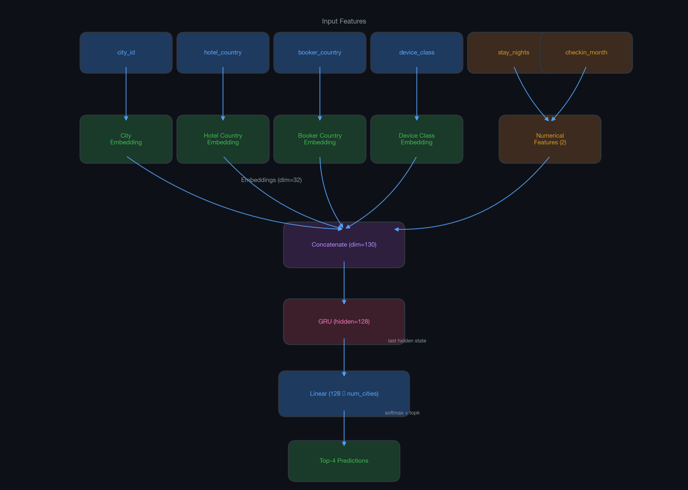
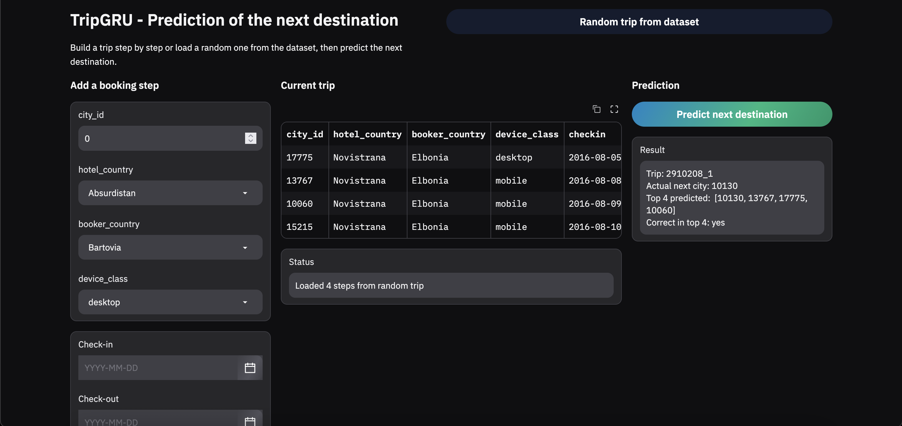

# Machine Learning Model for predicting a next destination

## ⚠️ WIP
This project is currently in progress. It is not ready yet and the model is very bad at the moment. I'm working on it during my free-time. :)

This project provides a machine learning model built on data pipelines using the [Booking.com Multi-Destination Trip Dataset](https://huggingface.co/datasets/Booking-com/multi-destination-trip-dataset) to predict the four most likely next destinations for a customer.

# Overview

This project uses `uv` as their dependency manager.
> Run `uv sync` first to sync all packages.

It also uses `black` for formatting, which is runned before every commit with `pre-commit`.

The project is divided in four main files:
- `main.py`: Trains a new model
- `inference.py`: Run the trained model on a random trip from the dataset
- `app.py`: Gradio app to play with the model
- `notebook.ipynb`: Explains and dives a bit in the dataset
- `report/report.pdf`: Report for this project